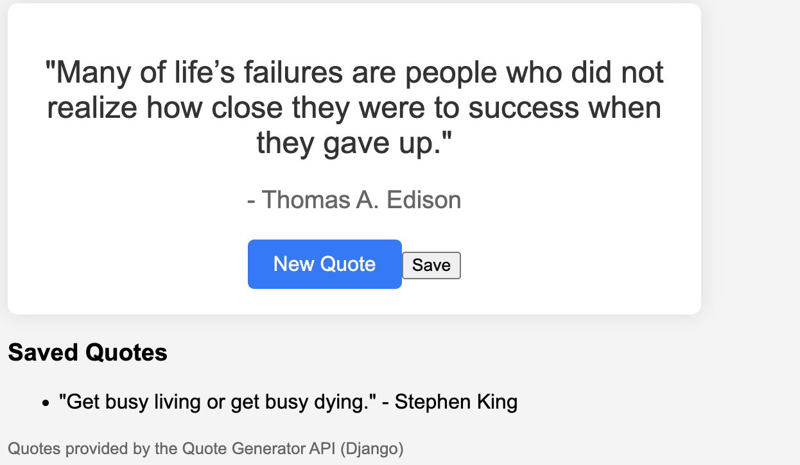

# QUOTE GENERATOR

## Django/React

This quote generator app uses React for the front-end and Django for the back-end.

### Front-End Components:
- `Foot.js`
- `NewQuoteButton.js`
- `SaveQuote.js`
- `SavedQuotes.js`

### Back-End (Django):
The back-end is built using the Django framework and provides the following API endpoints:
- **Quotes API:** `http://127.0.0.1:8000/api/quotes/`
- **Saved Quotes API:** `http://127.0.0.1:8000/api/saved-quotes/`
- **Save Quote API:** `http://127.0.0.1:8000/api/save-quote/`

### Application Features:
- **Quote Rendering:** A random quote is rendered when the site is launched.
- **New Quote Generation:** Users can generate new quotes by clicking the "New Quote" button.
- **Save Quotes:** When the "Save" button is clicked, the corresponding quote is saved to a SQLite database.
- **Database Management:** Although a delete functionality was not implemented, you can clear the database content using the command `python manage.py flush`.

### AWS Deployment:
For deploying this app on AWS:
- Use **Elastic Beanstalk** for an all-in-one environment that handles the Django back-end.
- Use **RDS** (Relational Database Service) for database management.
- Use **S3** (Simple Storage Service) to store the front-end components.

---
